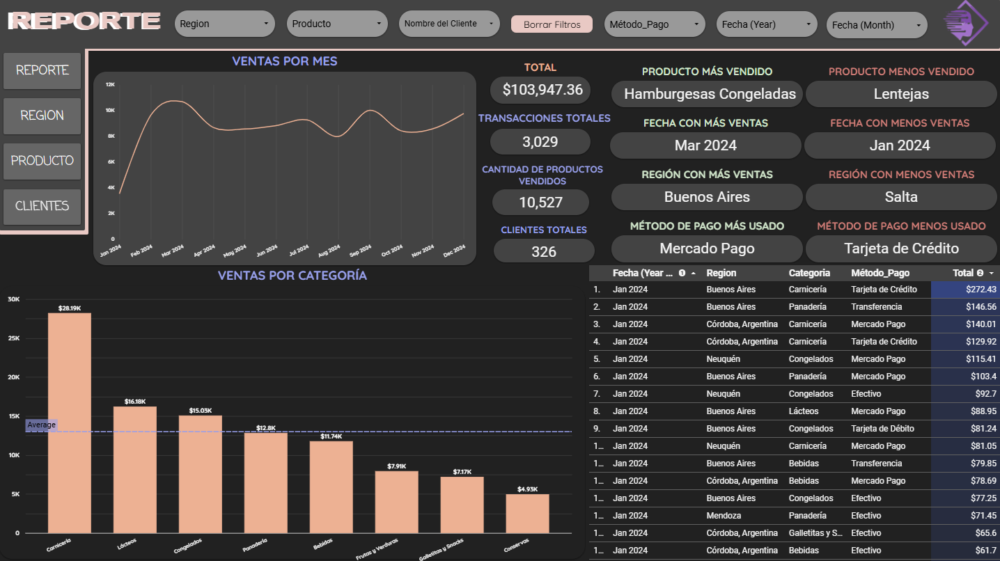
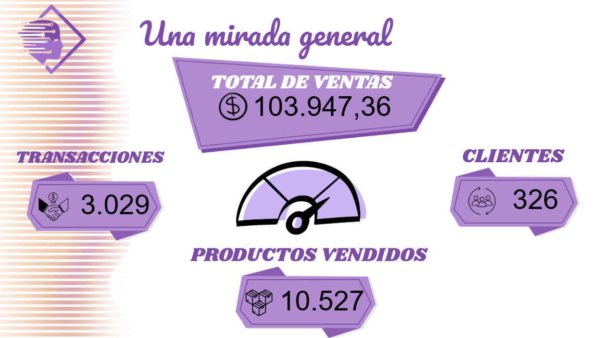

# 🏪DatawiseConsulting

> Proyecto final del curso de Business Intelligence, donde apliqué herramientas como Google Sheets y Looker Studio para desarrollar un dashboard interactivo con foco en un negocio de e-commerce.

Realicé un proceso completo de análisis que incluyó:

- Recolección y limpieza de datos.
- Análisis exploratorio con filtros por mes, región, cliente y método de pago.
- Visualización interactiva de KPIs clave: ventas, productos destacados, comportamiento de compra, entre otros.
- Investigación sobre el uso ético de los datos (caso Cambridge Analytica).

Además, preparé una presentación estilo storytelling para defender el proyecto en Google Slides.

<!-- TechStack -->
## :space_invader: Herramientas

  
Herramientas & Apps

  <ul>
    </a>
    </a>
    </a>
    </a>
  </ul>

Base de Datos

  <ul>
    ></a>
  </ul>

<! -- ## 📁Archivos -->
